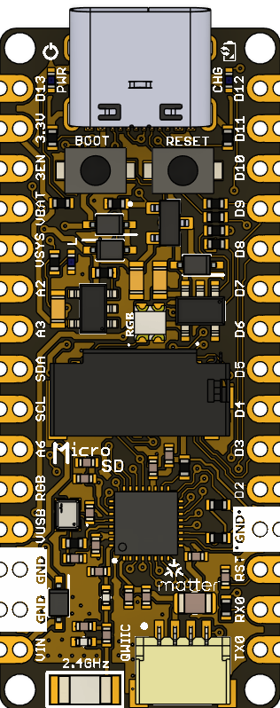

# UNIT PULSAR ESP32 H2 Development Board

The **UNIT PULSAR ESP32 H2** is a cutting-edge development board designed for IoT applications, leveraging the powerful ESP32 H2 microcontroller.  Inspired by the arduino nano form factor, this board is perfect for developers looking to create compact and efficient solutions.

    

### Quick Setup

We are currently working on the design of this new development board, **UNIT PULSAR ESP32 H2**, at UNIT Electronics. Stay tuned for upcoming updates, including the schematic and future iterations. Our goal is to provide comprehensive resources that support the use and development with the UNIT PULSAR ESP32 H2.

---

For more details and updates, make sure to follow this repository and check back regularly!

### Features

## Applications

##  Resources

## License

This project is licensed under the **MIT License**. For more details, please refer to the LICENSE file in this repository.

  Template created by UNIT Electronics 

